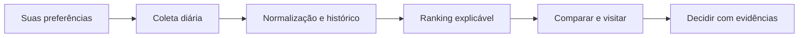

<div align="center">


# Imóvel Radar

### Seu próximo endereço, com contexto.

Organize sua busca pela casa própria. Acompanhe anúncios, compare preços e custos, registre visitas e decida com evidências.

[](https://github.com/eep0x10/imovel-radar/actions/workflows/tests.yml)
[](requirements.txt)
[](docs/PRIVACY.md)
[](README.en.md)

[Começar](#comece-em-poucos-minutos) · [Funcionalidades](#da-busca-à-decisão) · [Documentação](#documentação) · [English](README.en.md)

</div>

> **Preço bom precisa de contexto.** Qualidade observada, aderência às suas preferências e comparação de preços são medidas separadas. Dados ausentes aparecem como pendências, exceto a fase: sem indicação de planta ou obra, a regra do produto classifica o imóvel como pronto.
>
> O banner é uma ilustração de marca criada com IA, não uma fotografia de um imóvel anunciado.

## Da busca à decisão

| Encontre | Entenda | Organize |
| :--- | :--- | :--- |
| Coleta paginada de QuintoAndar e Loft; feeds e importações CSV, JSON, XLSX e XML VRSync. | Preço/m², comparáveis recentes, histórico de preços, custo mensal e simulação SAC/Price. | Conta privada, favoritos, comparação, visitas, checklist, avaliações e notas. |



## Comece em poucos minutos

Requisitos: Git e Python 3.11 ou superior. Testado também em Python 3.14.

```powershell
git clone https://github.com/eep0x10/imovel-radar.git
cd imovel-radar
./scripts/run.ps1
```

Abra **http://127.0.0.1:8766**, crie sua conta com senha de pelo menos **8 caracteres** e ajuste os filtros diretamente no **Radar**.

<details>
<summary>Linux e macOS</summary>

```sh
python3 -m venv .venv
.venv/bin/python -m pip install -r requirements.lock
.venv/bin/python run.py
```

</details>

1. No **Radar**, configure orçamento, metragem, quartos, banheiros, vaga, andar e preferência de metrô; alterações são aplicadas automaticamente.
2. Em **Configurações → Fontes e atualização**, ative QuintoAndar e Loft e execute a primeira coleta.
3. Clique em **Pesquisar nas fontes** para consultar os portais com os filtros atuais. A coleta ocorre em segundo plano, com progresso e falhas por fonte; resultados aparecem sem recarregar a página. Editar filtros sozinho refina os anúncios já coletados. Consulte anúncios no radar. Use **Aplicar minha busca** para restringir aos critérios e examine pendências.
4. Compare imóveis sem sair da lista e salve favoritos na aba **Salvos** do Radar.
5. Use **Criar alerta desta busca** para receber notificações apenas de novos imóveis compatíveis; os anúncios existentes formam a lista inicial, sem avisos retroativos.
6. Em **Configurações**, gerencie nome da conta, fontes, importações, diagnósticos e exportação.

As buscas salvas consultam as fontes usando seus próprios critérios, mesmo quando os filtros do Radar mudam. A primeira coleta é iniciada pelo worker; depois roda diariamente. Falhas têm nova tentativa após uma hora. A cobertura pode ser parcial por limites ou bloqueios dos portais.

O processo inicia API e worker. Por padrão, a rotina diária roda às 7h de `America/Sao_Paulo`. O computador e a aplicação precisam estar ligados. Não há coleta se as fontes estiverem pausadas.

## Fontes e cobertura real

| Fonte | Modalidade | Limites |
| :--- | :--- | :--- |
| QuintoAndar | Coleta da resposta pública utilizada pela busca | Paginação limitada, formatos sujeitos a mudança e bloqueios explícitos |
| Loft | Coleta da resposta pública utilizada pela busca | Mesmos cuidados; impostos sem periodicidade comprovada ficam desconhecidos |
| Feed próprio | URL JSON, CSV ou XML VRSync | Validação de rede, tamanho, formato e autorização da fonte |
| Planilhas | Prévia e importação de XLSX, CSV e JSON | Sem atualização automática do arquivo original |
| ZAP e Imovelweb | Acesso HTTP bloqueado na verificação atual | Importação de arquivo ou feed disponível; sem coletor ativo |

Os coletores não representam parceria ou API oficial. A cobertura informada corresponde às páginas efetivamente lidas. Nenhuma ausência em uma coleta parcial marca um anúncio como vendido. Veja [contrato das fontes](docs/SOURCES.md).

## Um ranking que explica suas limitações

- **Qualidade:** só recebe nota com pelo menos 70% dos dados necessários; condição, iluminação e documentação podem ser avaliadas na visita.
- **Aderência:** compara suas prioridades e restrições; ausência de informação não vira uma confirmação positiva.
- **Oportunidade:** exige anúncio recente e pelo menos três comparáveis únicos da mesma região e faixa de área. Mostra amostra e confiança; usa preços pedidos, não transações concluídas.
- **Orçamento:** separa valor de compra, despesas mensais, entrada, juros, custos de aquisição e reserva. IPTU com periodicidade desconhecida não é inventado.

## Fases e mudanças de preço

O Radar trabalha com **Pronto** e **Na planta / em construção**. Sem indicação de planta ou obra, o anúncio é classificado como pronto por padrão; isso não substitui a confirmação no anúncio ou na visita.

Cada card identifica a última mudança de preço observada nos **últimos 30 dias**, com valor anterior, diferença e data. Uma atualização sem mudança de preço não renova esse período. Uma primeira observação não é tratada como queda; sem data observada válida, o sistema não afirma recência.

## Dados sob seu controle

Contas isoladas, senhas com scrypt, sessões revogáveis, importação transacional e backup SQLite online. `.env`, bancos, planilhas pessoais, logs e exportações ficam fora do Git. A chave Google Maps é opcional e pertence exclusivamente ao ambiente local; nunca ao frontend.

O projeto foi rebatizado de `imovel-search-SP` para **`imovel-radar`**. Consulte [privacidade e limpeza do histórico](docs/PRIVACY.md) antes de reutilizar clones antigos.

## Documentação

| Guia | Conteúdo |
| :--- | :--- |
| [Início rápido](docs/QUICKSTART.md) | Instalação, conta e primeira coleta |
| [Operação](docs/OPERATIONS.md) | Agenda, backup, restauração e Docker |
| [Fontes](docs/SOURCES.md) | Scraping, limites, campos e cobertura |
| [Arquitetura](docs/ARCHITECTURE.md) | API, armazenamento, ranking e worker |
| [Privacidade](docs/PRIVACY.md) | Segredos locais, histórico e publicação |
| [Identidade](docs/BRAND.md) | Nome, cores e banner |
| [Contribuir](CONTRIBUTING.md) | Testes e critérios de revisão |

## Validação e limites

```powershell
./.venv/Scripts/python.exe -m pytest -q
./.venv/Scripts/python.exe scripts/privacy_audit.py
npx --yes prettier@3.6.2 --check "web/**/*.{html,css,js}"
```

A API está documentada em `/api/docs`. O padrão de execução é local. Exposição na internet exige HTTPS e operação de backups; recuperação de senha por e-mail e MFA não estão implementados. Alertas são internos ao aplicativo. Não há integração de índices de transações, mapas de risco ou garantia de disponibilidade/cobertura do mercado.

Projeto independente, sem afiliação com os portais. O ranking auxilia a pesquisa e não substitui vistoria, análise documental ou negociação.
